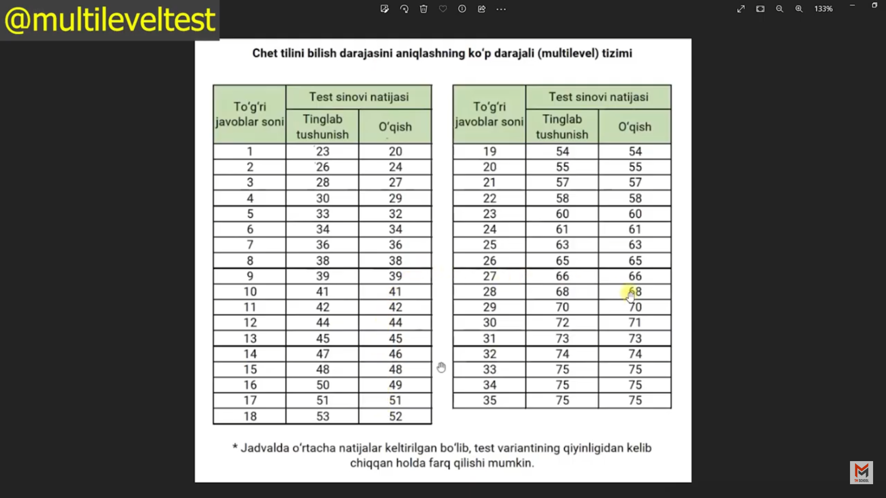

# !!!ALERT!!!

Multilevel imtihonida qaytarilishga moyil bo’lgan savollar asosan:

Listening Part 3
Listening Part 4
Listening Part 5
Reading Part 1
Reading Part 3
Reading Part 4

-lar bo’ladi.

Shu hafta ham aynan qaysidir savol turi albatta qaytariladi.
Task 2 uchun bir kichik variant 🔥

“Advantages and disadvantages  about working remotely from home”
 
Tahmin qiling deb so’rashgan edi )

Reading Part 5 🔥

Texnologiyalar rivojlanishi va atrof-muhit haqida haqida

30. Commercial
31. Result
32. Impact
33. Intersect
34. What is Bona City described as? C) Town in South of Texas
35. Main idea of the passage? – The clash between technology improvement and environmental protection

Shu Part 5 lar ko’p qaytalanadi 💯

